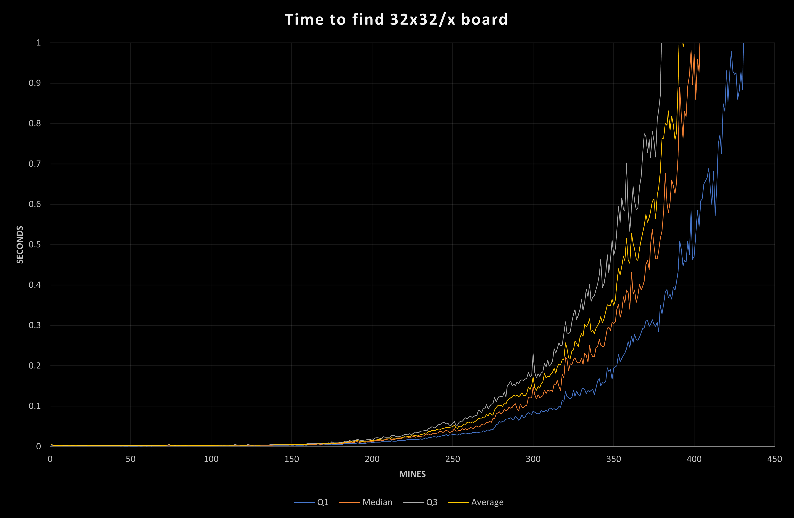
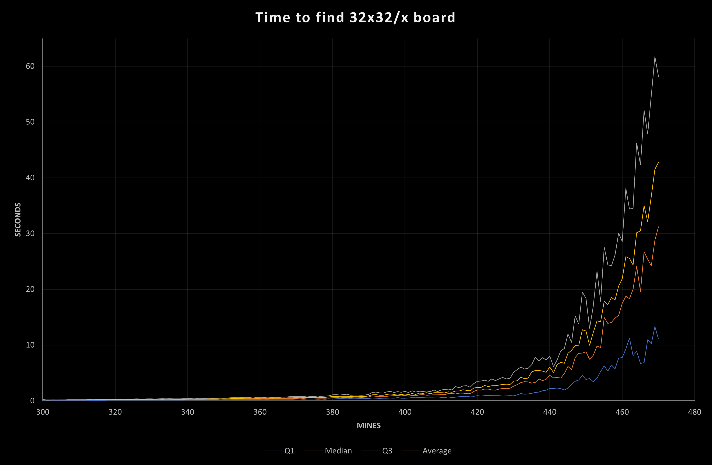

# No Guessing Board Generation Algorithm
- [Notation](#Notation)
  - [Knowledge States](#Knowledge-States)
- [Approach](#Approach)
- [Assigning Regions](#Assigning-Regions)
- [Trivial Solver](#Trivial-Solver)
- [Brute Combination Solver](#Brute-Combination-Solver)
  - [Feasibility](#Feasibility)
  - [Progress Tracking](#Progress-Tracking)
- [Performance](#Performance)
  - [Multithreading](#Multithreading)

# Notation

When talking about an abstract square `S`, using it as a number would be referring to the number of mines that border
that square. For example for `S ≤ 8` would mean that `A` has 8 or fewer mines bordering it. `S!` represents the set of 
squares that border `S`, so could be used like `∀ Q ∈ S! : |S - Q| ≤ 5` would mean that the difference between any two
adjacent squares is less than or equal to 5. 

A few predicate functions are defined below, each can either be applied to 
a single square, or to a set of squares. When a predicate function is applied to a set of squares, it acts as a filter, 
and the outcome should be considered to be the subset for which that predicate is true, for example, `|m(S!)| = S`. 
¬g(S!) means the subset for which the predicate function g is not ⊤.

- `m(S)`: `⊤` if `S` is a mine.
- `f(S)`: `⊤` if `S` is flagged in the current state
- `r(S)`: `⊤` if `S` is revealed in the current state. Flagged counts as revealed.

`b` represents the set of all squares on the board.

## Knowledge States

For various purposes, squares can generally be split into four "knowledge" states, represented as sets.

- `s` Satisfied squares, `S ∈ s := S! = r(S!) ∨ f(S)`
- `e` Edge squares, `S ∈ e := r(S) ∧ S ∉ s`
- `h` front squares (don't you dare ask why h), `S ∈ h := ¬r(S) ∧ ∃ Q ∈ S! : Q ∈ e`
- `u` unknown squares `S ∈ u := ¬r(S) ∧ S ∉ f`

For the most part, squares will move down those states as the board is solved, and new squares will be revealed in `f` 
based on the information provided by squares in `e`.

# Approach

The general approach for this algorithm is to generate a random board, then check to see if the board is solvable by 
attempting to solve the board. 

# Assigning Regions

On a solvable board, not all squares can be started from, so the solver attempts to solve the board from different 
starting positions. A valid starting position for a no guessing board must be a 0 square[^1]. A number starting square
either provides no information about the distribution of the mines bordering it or the distribution of mines in the rest
of the board. The first step of this solver is to label each connected region with an ID. A random id is selected to be
a starting point, then the solver tries to solve the board after revealing all the squares with that id. If the solver
is successful, then a random square in that region is selected to be the starting square, otherwise, it marks that
region as impossible, along with any other regions that the solver uncovered in that attempt and a new region is chosen.

[^1]: There are some edge cases, such as when there is only one open square, or if there are 8 or fewer mines. This
Algorithm does not consider these edge cases because they don't provide interesting boards.

# Trivial Solver

Any square in `S ∈ e` can be "trivially" moved to `s` when one of the two conditions are met.

`|¬r(S!)| = S - |f(S!)|` : `¬r(S!)` must all be mines, so they should be flagged.

`f(S!) = S` : `¬r(S!)` are all safe, so they can be revealed.

All squares in `e` should be checked for these conditions until neither of these conditions are met for all squares in
`e`. This solver will not be able to fully solve all NG boards, but it is significantly faster than the brute solver, so
it should be used to save time on the brute solver.

# Brute Combination Solver

The basis for this brute solver is to take a square `S ∈ h` and guess if it is a mine or not, then continue solving for 
all squares in `h` until a "feasible" solution is found. If a feasible solution is *not* found then the opposite of the
original guess must be correct. If a feasible solution is found for both states, then that proves that more information
is needed to solve that square. The trivial solver can be used to fill in guesses for a feasible solution, but cannot be
used to actually reveal a square while guessing.

## Feasibility

A candidate solution is considered feasible all visible constraints are met, meaning: 

- `∀ S ∈ e : |f(S!)| ≤ S` : no squares have more flags than they should have.
- `|m(b)| ≥ |f(b)|` : there are not more flags on the board than mines.
- `∀ S ∈ e : |¬r(S!)| ≥ S - |f(S!)|` : all squares have enough open squares to be able to be satisfied.
- `|¬r(b)| ≥ |m(b)| - |f(b)|`: there are enough open squares to fit the remaining unflagged mines.

These conditions can be checked before there is a complete candidate solution.

## Progress Tracking

When a complete feasible candidate solution is found, it validates the possibility of every guess involved in that
solution. For example, assume that `e = {S, Q, A}`. The brute force solver might first guess that S is a mine, and come
up with the following feasible solution `f(S) ∧ ¬f(Q) ∧ ¬f(A)`, so it would next guess that S is not a mine, and it may
come up with another feasible solution `¬f(S) ∧ f(Q) ∧ ¬f(A)`. While these guesses were meant to prove that more
information is needed to determine `m(S)`, it coincidentally proves that more information is needed to determine`m(Q)`. 
It also proves that `¬f(A)` is feasible, so the only guess that might give any more information is `f(A)`. Tracking 
which squares in `e` have been flagged in previously found complete feasible candidate solutions can be used to 
massively limit the number of combinations that need to be explored. There is also a free complete feasible "candidate"
solution that can be found by peeking at the true board.

## Mine Counting Edge Case

While the feasibility checks do enable the brute solver to solve some mine counting cases, it fails to consider the case
where all mines are provably in `h`, but there are no provably safe squares in `h`. In this case, all squares in `u` are
safe and revealing them might provide enough information to locate the final mines. To cover this edge case, the number
of located mines in each feasible solution should be tracked. If the fewest number of mines in any feasible solution is
equal to the number of unflagged mines, then that proves that `u` is safe, so should be revealed.

# Performance

The following section is based on performance on an Intel i7-9750H. A performance summary for various mine densities on
a 32x32 board can be found in [`docs/performance-summary.csv`](performance-summary.csv) (N = 100). 

Most boards with a density under 40% can be found in less than a second.

As density increases, the unpredictability also increases. At around 45% mine density the lower 25th percentile takes
less than 10 seconds, but the upper 25th percentile takes upwards of a minute. Boards at this density can be generated
in a reasonable time frame, but not to scale, and only if the players are ok to wait a bit.

## Multithreading

For larger/more difficult boards, simultaneously attempting to solve multiple boards is an efficient way to find boards
quicker. By default, the solver will pick a number of threads to spawn based on mine density for the board type that has
been selected. Ideal density boundaries will likely depend on the CPU/system used.

| Density | Threads | 
|---------|---------|
| <0.1    | 1       |
| <0.27   | 2       |
| <0.35   | 3       |
| <1      | 4       |